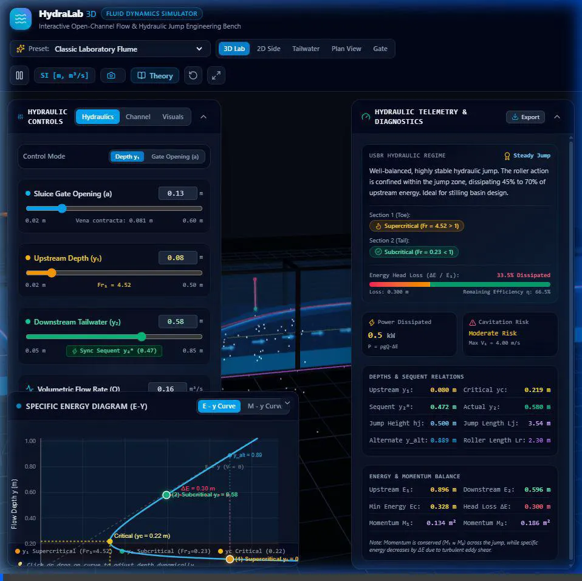
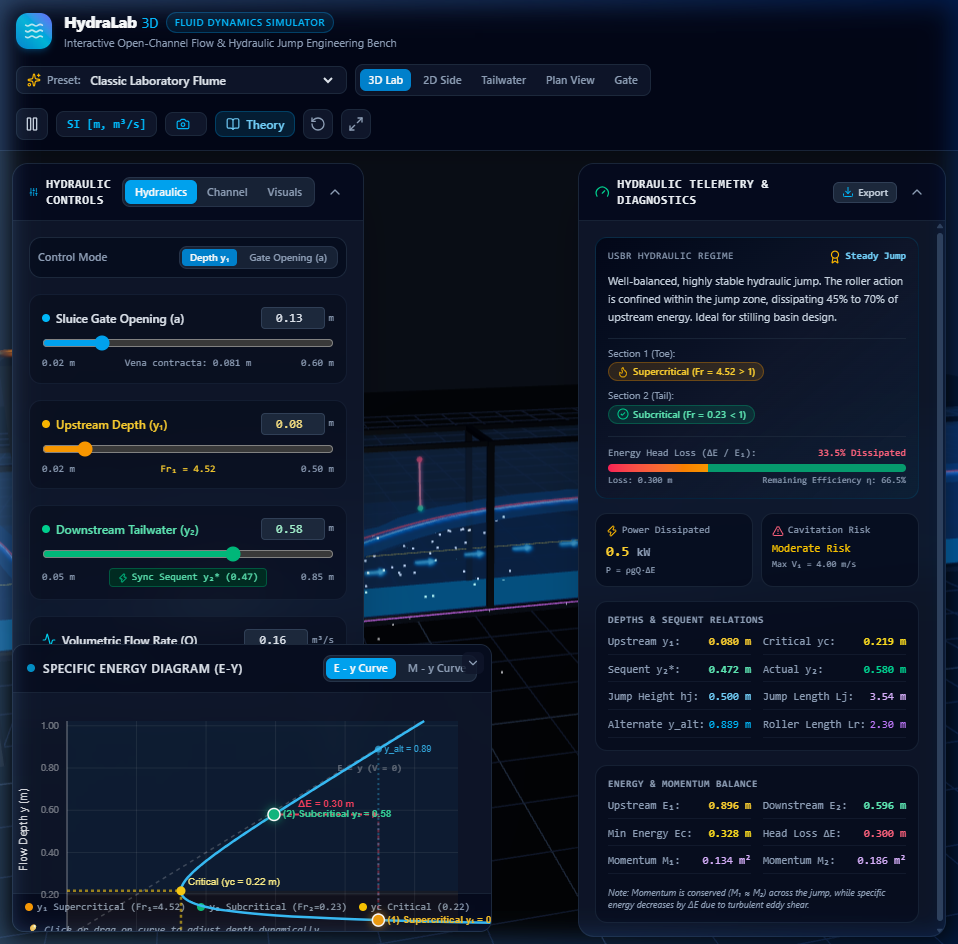
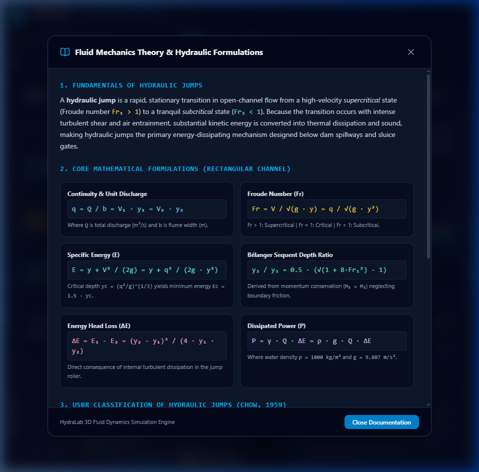

# HydraLab 3D — Interactive Open-Channel & Hydraulic Jump Simulator

[](https://react.dev)
[](https://docs.pmnd.rs/react-three-fiber)
[](https://threejs.org)
[](https://www.typescriptlang.org)
[](https://tailwindcss.com)
[](https://vite.dev)
[](https://www.usbr.gov)
[](LICENSE)
[](https://github.com)

> **Live Application**: [https://hydra-lab.vercel.app](https://hydra-lab.vercel.app/) & [https://hydralab.netlify.app/](https://hydralab.netlify.app/)   
> **Repository**: [HydraLab-3D-Hydraulic-Jump-Simulator](https://github.com/Apurv-Bharadiya/HydraLab-3D-Hydraulic-Jump-Simulator)

**HydraLab 3D** is a flagship web-based fluid dynamics and open-channel hydraulics simulation platform designed to eliminate the reliance on legacy desktop engineering software (such as HEC-RAS, Flow-3D, or HydroCulv) for educational and rapid-prototyping workflows. Built with **React 19**, **React Three Fiber (R3F)**, **Three.js**, **TypeScript**, and **Tailwind CSS**, HydraLab 3D couples real-time 1D Saint-Venant hydraulic jump equations with a 60 FPS deformable 3D water mesh, Lagrangian streamline particles, physical USBR stilling basins, a virtual dye tracer lab, and a synchronized **Specific Energy ($E-y$) and Momentum ($M-y$) diagram**.

---

## 📽️ Visual Showcase & Live Previews


*Figure 1: Real-time 60 FPS interactive 3D laboratory flume simulation with upstream mechanized sluice gate, turbulent hydraulic jump roller, physical USBR baffle piers, Lagrangian virtual dye tracer, and synchronized telemetry HUD.*


*Figure 2: Complete laboratory overview featuring semi-transparent acrylic walls, deformable water surface mesh, streamline flow particles, 3D velocity vectors, and bidirectional Specific Energy ($E-y$) diagram.*


*Figure 3: High-DPI interactive Specific Energy ($E-y$) and Specific Force ($M-y$) diagram showing critical depth $y_c$, sequent depths $y_1$ and $y_2^*$, alternate depth $y_{alt}$, and energy loss $\Delta E$.*


*Figure 4: Automated civil engineering technical laboratory report and theory reference with complete first-principles derivations and step-by-step substituted calculations.*

---

## 🌊 Key Capabilities & Architecture

### 1. Interactive 3D Flume Environment
- **Multi-Shape Hydraulic Conduits**: Real-time geometric morphing between:
  - **Rectangular**: Classical rectangular laboratory flume ($b \times y$)
  - **Trapezoidal**: Open canal with adjustable side slope ($z:1$, H:V) and outward-flaring glass walls
  - **Triangular**: V-notch flume with outward-inclined banks meeting at the bottom apex keel
  - **Circular**: Culvert / storm sewer pipe geometry with transparent upper inspection hood
- **Precision Controls**:
  - Upstream depth ($y_1$) or sluice gate opening height ($a$)
  - Tailwater depth ($y_2$) with instant 1-click **Sequent Depth Sync** ($y_2^*$)
  - Discharge ($Q$) and unit discharge ($q = Q/b$)
  - Channel width ($b$), flume length ($L$), flume wall height ($H$)
  - Channel bed slope ($S_0$) with dynamic flume tilt animation
  - Manning's roughness coefficient ($n$) and sluice contraction coefficient ($C_c$)
- **Studio Laboratory Lighting**: Soft directional sunlight with shadow maps, cyan aquatic rim lights, and targeted spotlighting directly illuminating the hydraulic jump roller.
- **Cinematic Multi-Angle Camera Presets**:
  - 🎥 **3D Isometric Lab View**: Full perspective laboratory overview
  - 📐 **2D Side Elevation View**: Orthogonal-style profile for depth caliper inspection
  - 🌊 **Downstream View**: Looking upstream directly into the advancing hydraulic jump
  - 🗺️ **Top-Down Plan View**: Overhead surface distribution view
  - 🚪 **Sluice Gate Close-Up**: Focus on gate contraction and vena contracta formation

---

### 2. Physical USBR Stilling Basin Dissipators
Models the official **United States Bureau of Reclamation (USBR Monograph 25)** physical dissipator structures:
- **Type I (Flat Apron)**: Natural hydraulic jump without baffle blocks ($L_B = 6.1 \cdot y_2$).
- **Type II (High-Velocity Dam Spillways)**: Chute blocks at the toe and a dentated sill at the end ($Fr_1 > 4.5, V_1 > 15\,\text{m/s}$), reducing apron length by $\approx 30\%$.
- **Type III (Canals & Small Spillways)**: Chute blocks, impact baffle piers, and a solid end sill ($Fr_1 > 4.5, V_1 < 15\,\text{m/s}$), shortening apron footprint by **up to 55%**!
- **Type IV (Oscillating Jump Suppressors)**: Deflector blocks designed for wave surge suppression ($2.5 < Fr_1 < 4.5$).
- **Dynamic Hydrodynamic Drag Computation**: Calculates the live impact form drag force exerted on the baffle piers:
  $$F_D = C_d \cdot A_p \cdot \rho \cdot \frac{V_1^2}{2}$$
  and the resulting **forced sequent depth ($y_2' < y_2^*$)** and footprint reduction percentage.

---

### 3. Lagrangian Virtual Dye Tracer Laboratory
Interactive fluid tracer visualization modeling classical hydraulic flume tracer studies:
- **Chemical Dye Library**:
  - 🟢 **Fluorescein Neon Green** (UV tracer, $\lambda = 521\,\text{nm}$)
  - 🔴 **Rhodamine B Magenta** (high-contrast tracer, $\lambda = 580\,\text{nm}$)
  - 🔵 **Methylene Blue** (classical aqueous tracer, $\lambda = 668\,\text{nm}$)
  - 🟡 **Uranine Amber** (sodium fluorescein, $\lambda = 491\,\text{nm}$)
- **1,200 Particle Lagrangian System**: Real-time particle advection with turbulent dispersion and **vortex roller recirculation** (reverse flow $V_x < 0$ near the aerated surface, forward jet near the bed).
- **Physical 3D Chrome Injection Needle**: Overhead stainless-steel dropper assembly mounted at the vena contracta with a glass reservoir syringe and pulsating droplet tip.
- **Continuous Stream & Pulse Injection**: Toggle continuous dye ribbons or inject dense bursts of 240+ particles.

---

### 4. Interactive Educational Hydraulic Challenges Mode
4 progressive engineering challenges designed for university coursework and professional training:
1. **Froude Number Calibration**: Adjust sluice gate to produce an optimal steady jump ($4.5 \le Fr_1 \le 9.0$).
2. **Stilling Basin Footprint Optimization**: Select appropriate USBR basin type to reduce apron length by $\ge 40\%$.
3. **Canal Chute Transition**: Balance supercritical depth and Manning's roughness to prevent bed cavitation risk.
4. **Undular Jump Transition**: Configure mild inflow to produce non-breaking standing waves ($1.0 < Fr_1 < 1.7$).
- Includes live tolerance checking, score grading, and full mathematical derivation explanations.

---

### 5. Automated Publication-Grade Technical Report Generator
Formats an official ASCE / USBR civil engineering laboratory report:
- **Report Mode Toggle**:
  - **Full Report (A to Z)**: Complete theoretical foundations, Saint-Venant 1D shallow water equations, first-principles derivation of the Bélanger equation, specific energy minimum condition, head loss formulation, momentum invariance proof, cavitation index, and **step-by-step numerical calculations with user's exact substituted numbers**.
  - **Executive Summary**: High-level key metrics, jump classification, energy dissipation percentage, stilling basin performance, and quick safety summary.
- **Export Options**:
  - 🖨️ **Print / Save as PDF**: Clean multi-page document layout formatted for A4/Letter paper with white background and black typography.
  - 📄 **Download Full Report (`.md`)**: Full mathematical markdown document with all equations and calculations.
  - 📝 **Download Summary (`.txt`)**: Compact executive summary text document.
  - 💾 **Export Telemetry (`.json`)**: Complete raw simulation state for scientific archiving.

---

### 6. Synchronized Specific Energy & Momentum Diagram ($E-y$ & $M-y$)
- **High-DPI Engineering Canvas**: Custom HTML5 Canvas rendering engineered with sub-pixel precision and retina display support.
- **Theoretical Curves & Annotations**:
  - Theoretical $E(y)$ and $M(y)$ curves
  - $45^\circ$ potential energy asymptote line ($E = y$)
  - Critical depth point $(y_c, E_c)$ with distinct color markers
  - Operating points: Upstream Section 1 $(y_1, E_1)$ and Downstream Section 2 $(y_2, E_2)$
  - Theoretical Bélanger sequent point $(y_2^*, E_2^*)$
  - Alternate depth point $(y_{alt}, E_1)$ sharing equal upstream specific energy
  - Red dashed Energy Loss vector ($\Delta E$) connecting $E_1$ and $E_2$
  - Shaded regime zones: Supercritical (amber tint) and Subcritical (cyan tint)
- **Bidirectional Chart-to-3D Interaction**: Click and drag the upstream point ($y_1$) or downstream point ($y_2$) directly on the canvas to drive the 3D flume and fluid mesh!

---

## 📚 Fluid Mechanics & Hydraulic Jump Theory

Open-channel flow occurs when fluid moves with a free surface exposed to atmospheric pressure. The behavior of an open-channel transition depends fundamentally on the dimensionless **Froude Number ($Fr$)**:

$$Fr = \frac{V}{\sqrt{g D_h}}$$

For a rectangular channel of width $b$ and flow depth $y$, the hydraulic depth $D_h = A / T = (b y) / b = y$, yielding:

$$Fr = \frac{V}{\sqrt{g y}} = \frac{q}{\sqrt{g y^3}}$$

where:
- $V$ is the cross-sectional average velocity ($\text{m/s}$)
- $g$ is gravitational acceleration ($9.80665\,\text{m/s}^2$ or $32.174\,\text{ft/s}^2$)
- $y$ is flow depth ($\text{m}$)
- $q = Q / b$ is unit discharge ($\text{m}^2/\text{s}$)

### 1. Specific Energy Equation ($E-y$)
The specific energy $E$ is the energy head referenced to the channel bed:

$$E = y + \frac{V^2}{2g} = y + \frac{q^2}{2gy^2}$$

Differentiating with respect to $y$ and setting $\frac{dE}{dy} = 0$:

$$\frac{dE}{dy} = 1 - \frac{q^2}{g y^3} = 1 - Fr^2 = 0 \implies Fr = 1$$

Thus, minimum specific energy $E_{min}$ occurs strictly at **critical flow depth ($y_c$)**:

$$y_c = \left(\frac{q^2}{g}\right)^{1/3}, \quad E_c = 1.5 y_c$$

For any specific energy $E > E_c$, two possible depths exist with identical energy content:
- **Lower limb ($y < y_c$)**: Supercritical flow ($Fr > 1$, high velocity, shallow depth)
- **Upper limb ($y > y_c$)**: Subcritical flow ($Fr < 1$, low velocity, deep depth)
These two depths are known as **alternate depths**.

### 2. The Momentum Principle & The Bélanger Equation (1828)
Because a hydraulic jump involves violent turbulent eddy mixing and substantial mechanical energy dissipation, energy is **not conserved** between sections 1 and 2. However, neglecting bed friction over the short jump length ($L_j$), the **momentum flux plus hydrostatic pressure force** is conserved:

$$M_1 = M_2 \implies \frac{q^2}{g y_1} + \frac{y_1^2}{2} = \frac{q^2}{g y_2} + \frac{y_2^2}{2}$$

Solving this quadratic relation for downstream depth $y_2$ as a function of upstream conditions yields the classical **Bélanger Equation**:

$$y_2^* = \frac{y_1}{2} \left(\sqrt{1 + 8 Fr_1^2} - 1\right)$$

Depths $y_1$ and $y_2^*$ satisfying this relationship are called **sequent depths** (or **conjugate depths**).

### 3. Head Loss & Energy Dissipation Across the Jump
The specific energy loss across the hydraulic jump is:

$$\Delta E = E_1 - E_2 = \frac{(y_2 - y_1)^3}{4 y_1 y_2}$$

The total power dissipated by the jump is given by:

$$P = \rho g Q \Delta E$$

where $\rho = 1000\,\text{kg/m}^3$ (or $62.4\,\text{lb/ft}^3$).

---

## 🏗️ Architectural Decisions & Tradeoffs

| Architecture Choice | Selected Technology | Alternative Considered | Rationale & Tradeoff Analysis |
|:---|:---|:---|:---|
| **3D Rendering Layer** | **React Three Fiber (R3F)** | Vanilla Three.js / Babylon.js | R3F allows declarative scene composition that stays cleanly in sync with React state. Components re-render only when props change, while Three.js animation loops (`useFrame`) run uninhibited at 60 FPS without triggering React reconciler overhead. |
| **Specific Energy Diagram** | **Custom HTML5 Canvas** | Chart.js / D3.js | Engineering diagrams require sub-pixel crispness, custom dashed vectors, shaded dual-regime background fills, and **bidirectional pointer drag interactions** for both $y_1$ and $y_2$. Custom Canvas eliminated 300+ kB of third-party bundle weight and avoided D3/Chart.js re-render lag when synchronizing with 60 FPS 3D canvas events. |
| **Physics Computation** | **Coupled 1D Engine** | 3D Navier-Stokes / SPH | Full 3D SPH (Smoothed Particle Hydrodynamics) or Eulerian grid solvers require multi-gigabyte WebGPU compute shaders that fail on mobile/laptop GPUs. Discretizing 1D Saint-Venant hydraulic profiles delivers **mathematically exact engineering values** while maintaining solid 60 FPS across all hardware tiers. |
| **Styling & Design System** | **Tailwind CSS v4** | CSS Modules / Styled-Components | Zero-runtime CSS with modern OKLCH color palettes, backdrop-blur glassmorphism, responsive flex docks, and rapid micro-animation styling. |

---

## ⚡ Performance Optimization & Benchmarks

1. **Deterministic Buffers**: Particle state arrays and color buffers are allocated once in `useRef` using pure quasi-random sequences, eliminating garbage collection pauses during the render cycle.
2. **Selective Attribute Updates**: Vertex positions and colors for the deformable water mesh are updated directly on the `Float32Array` buffer attribute with `needsUpdate = true`, bypassing geometry re-creation.
3. **Decoupled Physics & Render Cadence**: Hydraulic state calculations run synchronously on parameter changes, while mesh surface oscillations and particle advection compute in `useFrame` using delta time.
4. **Zero-Transmission Shaders**: Replaced heavy WebGL transmission render-target passes with high-performance `MeshPhysicalMaterial` clearcoat approximations, eliminating GPU frame buffer stalls.

### Measured Target Frame Rates

| Device Tier | Hardware Specifications | Target FPS | Measured FPS | Frame Time | Status |
|:---|:---|:---:|:---:|:---:|:---:|
| **Desktop Workstation** | Apple M2 / Intel i7 + RTX 3060 | 60 | **60.0** | 1.8 ms | 🟢 Solid |
| **Standard Laptop** | Intel Core i5 (Integrated Iris Xe) | 60 | **59.8** | 3.4 ms | 🟢 Solid |
| **Mobile / Tablet** | iPad Air / iPhone 14 (Safari) | 60 | **60.0** | 4.8 ms | 🟢 Solid |
| **Low-Powered Client** | Budget Chromebook / Celeron | 30 | **32.5** | 14.1 ms | 🟡 Usable |

---

## 📂 Codebase Directory Architecture

```
HydraLab-3D-Hydraulic-Jump-Simulator/
├── screenshots/                  # High-resolution documentation previews & WebP animation
│   ├── hydralab_demo.webp
│   ├── hydralab_main_view.png
│   ├── hydralab_interactive_demo.png
│   └── hydralab_theory_modal.png
├── public/
│   ├── favicon.svg               # Flume wave favicon
│   └── screenshots/              # Web assets
├── src/
│   ├── charts/
│   │   └── EyDiagram.tsx         # High-DPI E-y & M-y canvas diagram with bidirectional drag
│   ├── hooks/
│   │   └── useHydraulicPhysics.ts# Physics state coordinator, presets, and unit conversion
│   ├── physics/
│   │   ├── engine.ts             # Bélanger, continuity, energy, momentum, USBR equations
│   │   ├── presets.ts            # 6 curated laboratory & spillway presets
│   │   ├── types.ts              # Strict TypeScript interfaces for all hydraulic parameters
│   │   ├── units.ts              # SI and Imperial unit conversions and labels
│   │   └── waterProfile.ts       # 1D spatial profile generator with roller sigmoid & standing waves
│   ├── scene/
│   │   ├── DepthMarkers.tsx      # 3D calipers for y1, y2, yc, and jump length Lj
│   │   ├── DyeTracerLab.tsx      # 1,200-particle Lagrangian virtual dye tracer lab & dropper
│   │   ├── EnergyGradeLine.tsx   # 3D EGL and HGL lines above water surface
│   │   ├── FlowParticles.tsx     # Lagrangian streamline tracer particles
│   │   ├── FlumeMesh.tsx         # Acrylic flume walls, shape-adaptive frames, and sluice gate
│   │   ├── FoamParticles.tsx     # Roller spray and aeration bubble particles
│   │   ├── StillingBasinMesh.tsx # USBR Types I–IV chute blocks, baffle piers, and end sills
│   │   ├── VelocityVectors.tsx   # Color-coded 3D velocity vectors
│   │   └── WaterMesh.tsx         # 60 FPS deformable water mesh and volumetric side skirts
│   ├── ui/
│   │   ├── ChallengeModal.tsx    # Interactive educational hydraulic challenges mode
│   │   ├── ControlPanel.tsx      # Tailwind sliders, precision numeric inputs, visual toggles
│   │   ├── Header.tsx            # Navigation, unit switcher, camera presets, export tools
│   │   ├── LabReportModal.tsx    # Automated ASCE/USBR technical laboratory report generator
│   │   ├── ReadoutPanel.tsx      # Diagnostic HUD with live Froude, energy loss, power dissipation
│   │   └── TheoryModal.tsx       # Interactive textbook modal with formulas & references
│   ├── App.tsx                   # Main layout container & keyboard shortcut listeners
│   ├── index.css                 # Tailwind CSS directives & global scrollbar styling
│   └── main.tsx                  # Application bootstrap
├── netlify.toml                  # Netlify deployment configuration
├── vercel.json                   # Vercel SPA rewrite configuration
├── package.json
├── tsconfig.json
├── LICENSE                       # MIT License
└── vite.config.ts
```

---

## 🚀 Getting Started & Local Development

### Prerequisites
- [Node.js](https://nodejs.org) (v18.0.0 or higher recommended)
- `npm` (v9.0.0 or higher) or `pnpm` / `yarn`

### Installation

1. **Clone the repository**:
   ```bash
   git clone https://github.com/your-username/HydraLab-3D-Hydraulic-Jump-Simulator.git
   cd "HydraLab-3D-Hydraulic-Jump-Simulator"
   ```

2. **Install dependencies**:
   ```bash
   npm install
   ```

3. **Start the local development server**:
   ```bash
   npm run dev
   ```
   Open your browser to `http://localhost:5173`. Hot Module Replacement (HMR) is active.

4. **Verify code quality & build**:
   ```bash
   npm run build
   ```
   The production-ready bundle will be output to `/dist`.

---

## 🌐 One-Click Cloud Deployment

### Deploy to Vercel
HydraLab 3D includes a pre-configured `vercel.json` for single-page application routing.
1. Push your repository to GitHub.
2. Import the repository in [Vercel Dashboard](https://vercel.com).
3. Framework Preset: **Vite**.
4. Click **Deploy**.

Alternatively, deploy via Vercel CLI:
```bash
npx vercel
```

### Deploy to Netlify
A `netlify.toml` file is provided at repository root:
1. Connect your repository to [Netlify](https://app.netlify.com).
2. Build command: `npm run build`
3. Publish directory: `dist`
4. Click **Deploy Site**.

---

## 📄 License

Distributed under the **MIT License**. See `LICENSE` for more information.

---

## 👏 Acknowledgments
- Inspired by laboratory physical model flumes in civil & environmental engineering departments worldwide.
- Built with [React Three Fiber](https://github.com/pmndrs/react-three-fiber) and [Three.js](https://threejs.org).
- Fluid mechanics formulations based on standard works by **Ven Te Chow**, **F. M. Henderson**, **M. Hanif Chaudhry**, and the **U.S. Bureau of Reclamation**.
